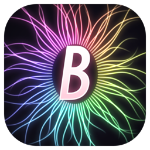
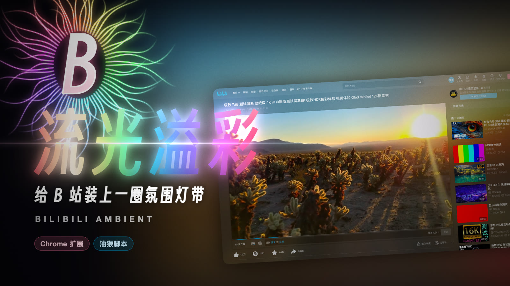
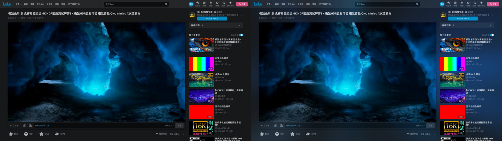
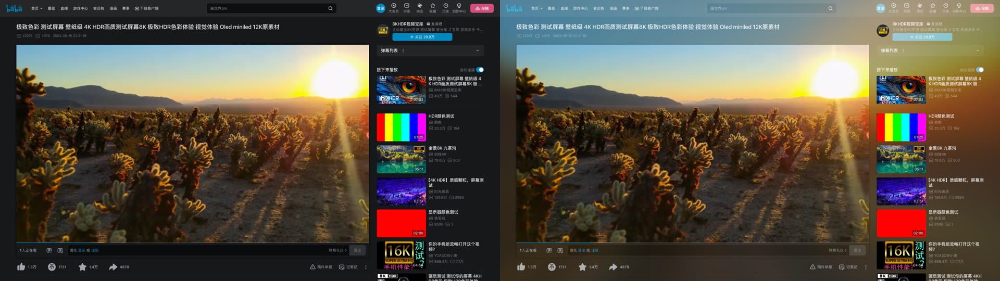
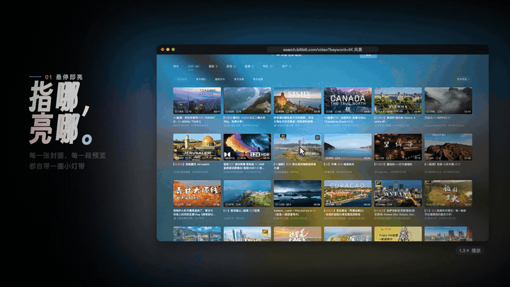
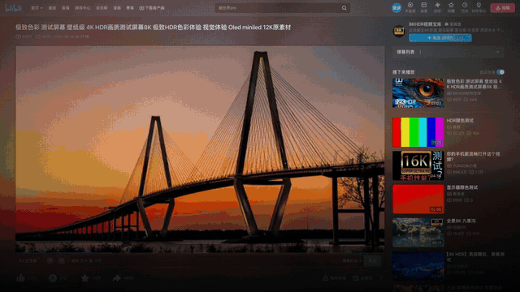
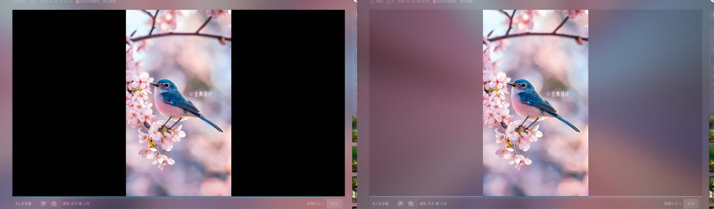
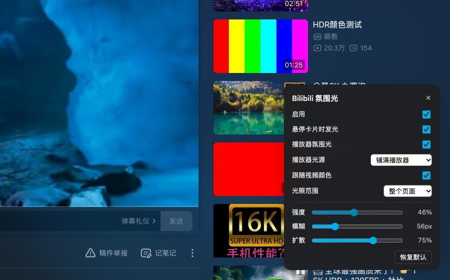

<p align="center">
  
</p>

<h1 align="center">Bilibili Ambient</h1>

<p align="center">
  An ambient "bias-light strip" for Bilibili — whatever colour the picture is, the page glows that colour.
</p>

<p align="center">
  <a href="README.md">中文</a> · <b>English</b>
</p>

<p align="center">
  <a href="../../releases"></a>
  
  
  <a href="LICENSE"></a>
</p>

<p align="center">
  
</p>

---

## Contents

- [Overview](#overview)
- [Features](#features)
- [Preview](#preview)
- [Installation](#installation)
  - [Option A: Chrome extension (recommended)](#option-a-chrome-extension-recommended)
  - [Option B: Userscript](#option-b-userscript)
- [Usage](#usage)
- [Settings](#settings)
- [Supported pages](#supported-pages)
- [FAQ](#faq)
- [How it works](#how-it-works)
- [Privacy & permissions](#privacy--permissions)
- [Development](#development)
- [Acknowledgements](#acknowledgements)
- [License & disclaimer](#license--disclaimer)

## Overview

You know the LED strip behind a TV or monitor that lights the wall with the colours on screen? **Bilibili Ambient** brings that to [Bilibili](https://www.bilibili.com) in your browser:

- **Hover** a video card and its cover (or the playing hover preview) radiates outward from the card's edges and softly lights the whole page;
- **Open a video page** and the player keeps glowing like a TV bias light, **changing colour with the picture in real time**;
- Images and videos themselves **always stay sharp** — the light only falls around them.

It ships in two forms with the same features — pick one:

| Form | For | Settings |
| --- | --- | --- |
| **Chrome extension** | Chrome / Edge / Brave and other Chromium browsers | Toolbar popup + in-page panel (`Alt+Shift+B`) |
| **Userscript** | Existing Tampermonkey / Violentmonkey users | Userscript-manager menu → in-page panel |

The Chinese name/tagline **流光溢彩** is a Chinese idiom meaning roughly "flowing light, overflowing colour".

## Features

- 🎨 **Hover to glow** — home feed, search results, related videos, dynamics, user spaces and live cards; covers and hover-preview videos alike.
- 📺 **Player bias light** — on video pages the player glows without hovering, following the picture at up to 12 fps; pausing and seeking update it too.
- 🔀 **Two light-source modes** (most visible with vertical videos):
  - **Fill the player** — light comes off the player's border; letterbox bars stay dark;
  - **Follow the picture** — light comes off the picture itself and spills into the letterbox (same as the original X Ambient).
- 🌗 **Light & dark themes** — `screen` blending (glow) on dark pages, `multiply` (soft tint) on light pages, switching automatically with Bilibili's and the system theme.
- 🎚️ **Adjustable** — intensity, blur, spread and lighting area; changes apply instantly and sync across tabs.
- 🧠 **Gets out of the way** — off in web-fullscreen, fullscreen and mini-player; honours "reduce motion".
- 🪶 **Lightweight & private** — draws with `drawImage` only, never reads pixels, no screen capture, no network; the extension requests only the `storage` permission.

## Preview

**Light off vs. on (same frame)**





**Hover cards** · **Player bias light**

<p>
  
  
</p>

**Light-source modes** (left: fill the player · right: follow the picture)



## Installation

> Use **one** of the two — enabling both stacks two layers of light.

### Option A: Chrome extension (recommended)

Works in Chrome, Edge, Brave, Arc and other Chromium browsers with Manifest V3.

1. Go to [Releases](../../releases), pick the release tagged **`extension-v…`** and download `bilibili-ambient-extension-v0.1.1.zip`.
2. Unzip it to get the `bilibili-ambient-extension` folder (it contains `manifest.json`).
   > Keep the folder somewhere permanent — Chrome loads the extension from it, and deleting it disables the extension.
3. Open `chrome://extensions` (`edge://extensions` in Edge) and turn on **Developer mode** (top right).
4. Click **Load unpacked** and select the folder from step 2.
5. **Reload** any Bilibili tabs that were already open.
6. (Optional) Pin **Bilibili Ambient** from the puzzle-piece menu for quick access to settings.

**Update:** download the new zip, replace the files in the folder, click the ↻ reload button on the extension card in `chrome://extensions`, then reload Bilibili. Settings are kept.

**Uninstall:** click **Remove** in `chrome://extensions`.

### Option B: Userscript

For browsers with [Tampermonkey](https://www.tampermonkey.net/) or [Violentmonkey](https://violentmonkey.github.io/).

1. Go to [Releases](../../releases), pick the release tagged **`userscript-v…`** and download `bilibili-ambient.user.js`.
2. Install it (either way):
   - **Paste**: open the manager's dashboard → **+** (new script) → replace the template with the full contents of `bilibili-ambient.user.js` → `Ctrl/⌘ + S`.
   - **Drag & drop**: enable **Allow access to file URLs** in the manager's extension details, drag the `.user.js` file into a browser window and click **Install**.
3. Reload Bilibili.

> **Chrome users:** recent Chrome versions require extra permission for userscript managers. Turn on **Developer mode** in `chrome://extensions`; on Chrome 138+ also enable **Allow User Scripts** on Tampermonkey's *Details* page.
>
> This repository is private, so `raw` URLs require sign-in — "install from URL" and automatic updates won't work. Repeat the steps above to update.

## Usage

### 1. Hover cards

Rest the pointer on any video card's cover (about 70 ms) and its colours spread out from the card across the page.

- Move to another card and the light switches to its colours;
- While Bilibili plays a hover preview, the light **follows the preview video live**;
- Text-only cards don't glow; on video pages the light falls back to the player.

### 2. Player bias light

On any video page (`/video/…`) or live room, the player glows continuously:

- Colours update at up to 12 fps while playing, and on pause and seek;
- Hovering a related-video card temporarily switches the light to that card, then back to the player;
- Automatically off in **web-fullscreen / fullscreen / mini-player**.

### 3. Light-source mode (vertical videos)

Vertical videos inside a wide player have letterbox bars on both sides — that's where the two modes differ:

| Mode | Result | Choose it if you want |
| --- | --- | --- |
| Fill the player (default) | The frame is stretched over the player area; light leaves the player's border; bars stay dark | A tidy, TV-style border glow |
| Follow the picture | Light leaves the picture itself and spills into the bars | The original X Ambient look |

### 4. Opening settings

| Form | How |
| --- | --- |
| Chrome extension | ① click the toolbar icon for the popup; ② on a Bilibili page press **`Alt+Shift+B`** (or click *Open the in-page panel* in the popup) for the **in-page settings panel**, so you can tweak while watching |
| Userscript | click the userscript-manager icon → **⚙️ 氛围光设置** (settings panel); **💡 开启 / 关闭氛围光** toggles the light |

- Change the shortcut at `chrome://extensions/shortcuts`. If it clashes with another extension Chrome leaves it unassigned (and the popup won't show it) — assign one manually.
- Changes apply immediately to every open Bilibili tab; *Reset* (恢复默认) restores the defaults.

<p align="center"></p>

## Settings

| Setting (UI label) | Default | Range / options | Notes |
| --- | --- | --- | --- |
| Enabled (启用) | On | On / Off | Master switch |
| Glow on card hover (悬停卡片时发光) | On | On / Off | Home, search, related, dynamics, space, live cards |
| Player ambient light (播放器氛围光) | On | On / Off | Players on video pages and live rooms |
| Player light source (播放器光源) | Fill the player | Fill the player / Follow the picture | See *Light-source mode* above |
| Follow video colours (跟随视频颜色) | On | On / Off | When off, colours update only on switch, pause and seek — saves power |
| Lighting area (光照范围) | Whole page | Whole page / Around the media | *Around the media* lights only near the current card or player |
| Intensity (强度) | 65% | 0–100% | Opacity of the light |
| Blur (模糊) | 56 px | 24–160 px | Higher is softer |
| Spread (扩散) | 75% | 20–100% | How far the light travels |

> Tip: on the dense dark home feed, 85–95% intensity looks best; in light mode, 50–65% is usually enough.

## Supported pages

| Page | URL | Hover cards | Player light |
| --- | --- | :---: | :---: |
| Home / categories | `www.bilibili.com` | ✅ | — |
| Video page | `www.bilibili.com/video/…` | ✅ (related) | ✅ |
| Anime / films | `www.bilibili.com/bangumi/…` | ✅ | ✅ (non-DRM) |
| Search | `search.bilibili.com` | ✅ | — |
| Dynamics | `t.bilibili.com` | ✅ | — |
| User space | `space.bilibili.com` | ✅ | — |
| Live | `live.bilibili.com` | ✅ | ✅ |

> Home, video and search pages were tested on the live site; anime, dynamics, space and live are adapted from their page structure but not yet individually verified — reports welcome.

## FAQ

<details>
<summary><b>Nothing happens after installing</b></summary>

1. Reload the Bilibili tab (scripts only run in pages loaded after installation);
2. Make sure *Enabled* is on and intensity is above 0;
3. Don't run the extension and the userscript at the same time;
4. Userscript on Chrome: check Developer mode / *Allow User Scripts* (see installation);
5. The light is off while the browser is fullscreen.
</details>

<details>
<summary><b>No light on some anime or films</b></summary>

DRM-protected video cannot be drawn into a canvas — the browser returns black frames. This is a browser security restriction and can't be bypassed.
</details>

<details>
<summary><b>Light theme looks greyish</b></summary>

Light pages use `multiply` blending, so dark scenes darken the page. Lower the intensity or switch Bilibili to dark mode (which only brightens).
</details>

<details>
<summary><b>Alt+Shift+B does nothing</b></summary>

It probably clashes with another extension. Assign a shortcut for *Bilibili Ambient → toggle the in-page settings panel* at `chrome://extensions/shortcuts` (`edge://extensions/shortcuts` in Edge), or open the panel from the toolbar popup.
</details>

<details>
<summary><b>Performance</b></summary>

The light field is computed on a 256 px canvas and blurred/upscaled on the GPU; video sampling is capped at 12 fps via <code>requestVideoFrameCallback</code>. On slower machines, turn off *Follow video colours* or set the lighting area to *Around the media*.
</details>

<details>
<summary><b>Broken after a Bilibili redesign</b></summary>

Cards and players are found with CSS selectors; a redesign may require updating <code>CARD_SELECTOR</code> / <code>PLAYER_*</code> at the top of <code>extension/src/content.js</code> (and the userscript). Issues welcome.
</details>

## How it works

<details>
<summary>Expand</summary>

1. **Sample the edges** — the hovered cover / preview video, or the player's current frame, is drawn into a 144 px-wide mosaic canvas;
2. **Project the light** — ~4% edge strips are stretched outward ring by ring with exponential falloff (ray projection);
3. **Soften** — the light field gets CSS `blur()` + `saturate()` and is blended over the page with `screen` (dark) or `multiply` (light);
4. **Protect the media** — an SVG mask cuts holes at every image, video (and the player) so the media itself stays crisp;
5. While a video plays, `requestVideoFrameCallback` repaints at up to 12 fps; two canvases cross-fade for smooth transitions.

Only `drawImage` is used — pixels are **never read back or exported**, so cross-origin covers work too.
</details>

## Privacy & permissions

- The extension requests only **`storage`**, used to keep your settings locally;
- Content scripts run only on the Bilibili pages listed above;
- No screen capture, no network requests, no data collection; no second video player is created;
- The userscript only uses `GM_getValue` / `GM_setValue` / `GM_registerMenuCommand` / `GM_addValueChangeListener`.

## Development

```text
bilibili-ambient/
├── extension/                 Chrome extension (Manifest V3)
│   ├── manifest.json
│   ├── icons/
│   └── src/
│       ├── settings.js        defaults & validation (shared by content script and popup)
│       ├── ambient-core.js    geometry & ray projection (from X Ambient)
│       ├── content.js         renderer + in-page settings panel
│       ├── background.js      keyboard shortcut → in-page panel
│       └── popup.html/css/js  toolbar popup
├── userscript/
│   └── bilibili-ambient.user.js   single-file userscript, same features
├── docs/images/               README images
├── scripts/package.sh         builds release assets
├── CHANGELOG.md
└── LICENSE
```

- No Node.js and no build step: edit, then *Load unpacked* (or save in your userscript manager) to test.
- Build release assets (needs `zip` and `python3`):

  ```bash
  ./scripts/package.sh
  ```

  This writes `dist/bilibili-ambient-extension-v<version>.zip` and `dist/bilibili-ambient.user.js`.
- Releases: the extension is tagged `extension-v<version>`, the userscript `userscript-v<version>`; they are released separately.

## Acknowledgements

The idea and the core rendering approach come from **[mmnga/x-ambient](https://github.com/mmnga/x-ambient)** — a Chrome extension that lets photos and videos light up the X (Twitter) timeline. Ray projection, the media mask and the draw-only, never-read-pixels technique all originate there, and `ambient-core.js` is reused from the original project (MIT).

Huge thanks to **[@mmnga](https://github.com/mmnga)** for open-sourcing such a wonderful idea 🙏

## License & disclaimer

- Released under the [MIT License](LICENSE), retaining the original X Ambient copyright notice.
- This is a personal project, **not affiliated with, endorsed or sponsored by Bilibili**. "bilibili", "哔哩哔哩" and related marks belong to their respective owners.
- Screenshots in this README are real screen recordings; the videos and covers shown belong to their uploaders.
- 「流光溢彩」 is used here only as a descriptive Chinese idiom.
